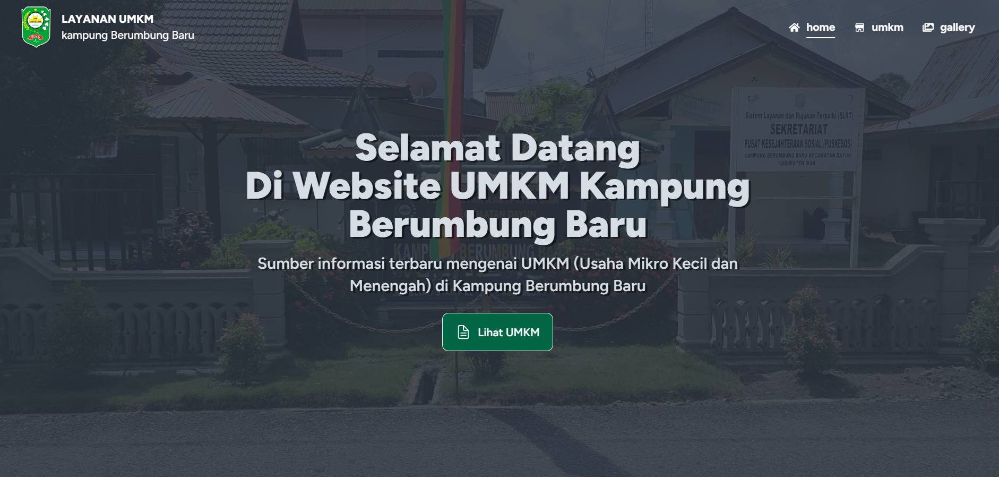
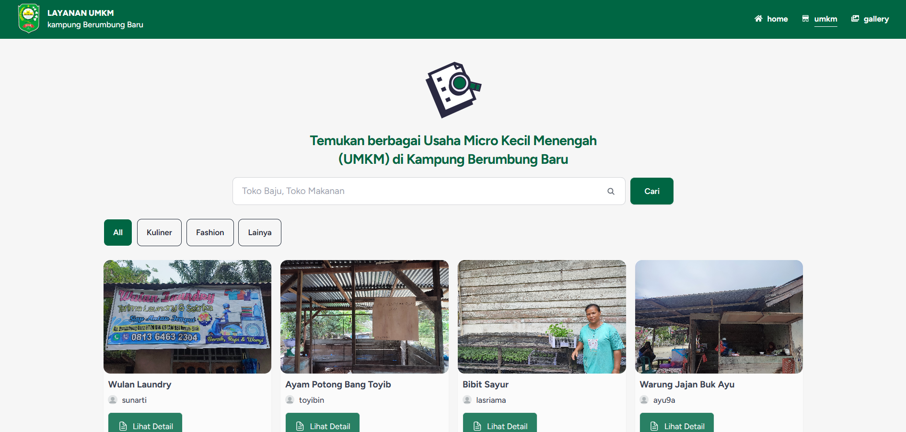

<h1>Website Layanan UMKM - Berumbung Baru</h1>

This is the complete project repository

<h2>Features</h2>

<ul>
	<li><strong>Search:</strong> Easily find restaurants and bars using our intuitive search feature.</li>
</ul>

<h2>Technical Stack</h2>

<ul>
	<li><strong>Language:</strong> TypeScript</li>
	<li><strong>Framework:</strong> React.js</li>
	<li><strong>Database:</strong> Firebase</li>
	<li><strong>Styling:</strong> Tailwind</li>
	<li><strong>Framework Styling:</strong> daisyUI</li>
</ul>
